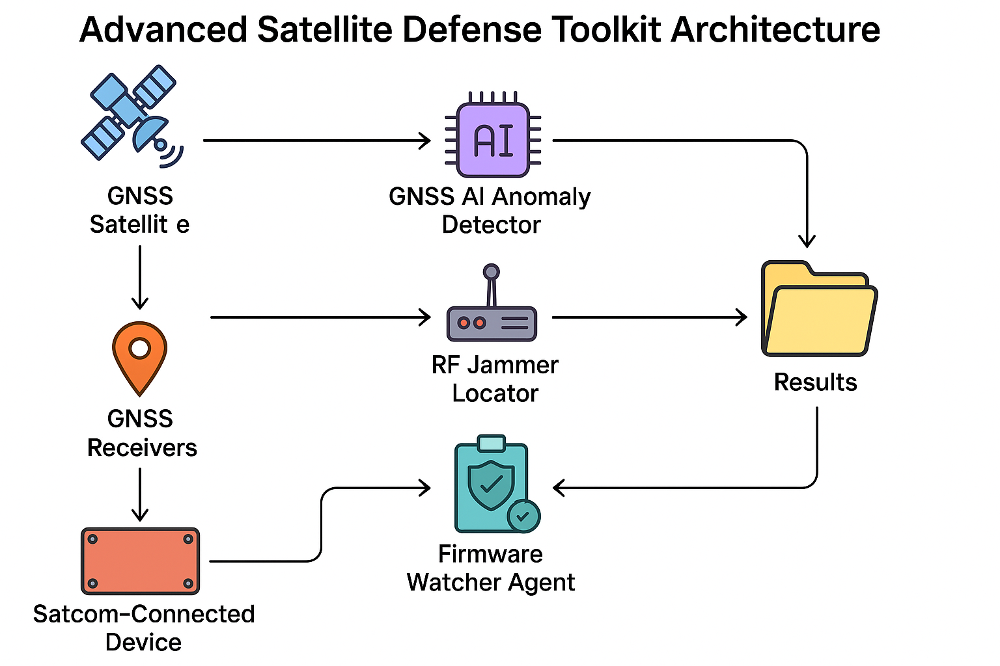

# 🛰️ Satellite Defense Toolkit

A modular, AI-driven framework for defending GNSS- and SATCOM-dependent systems, with a focus on medical and critical infrastructure telemetry.

## 📦 Modules
| Module | Description |
|--------|-------------|
| `gnss_ai_anomaly_detector.py` | ML-based detection of spoofing attacks using signal patterns |
| `rf_jammer_locator.py` | SDR-based uplink jammer triangulation |
| `firmware_watcher_agent.py` | HMAC-secured firmware monitoring |
| `telemetry_lstm_monitor.py` | LSTM model for voltage/temp/heartbeat anomaly detection |

## 🚀 Usage

```bash
python3 satellite_defense_toolkit_launcher.py
```

## 📊 Architecture



## 📡 Use Case Scenarios

- Detect spoofed GNSS signals near medical facilities
- Locate uplink RF interference in mobile clinics
- Monitor firmware changes in satellite-connected IoT devices
- Flag abnormal health telemetry patterns with LSTM

## 🔐 License

MIT — Free to use, extend, or adapt.
